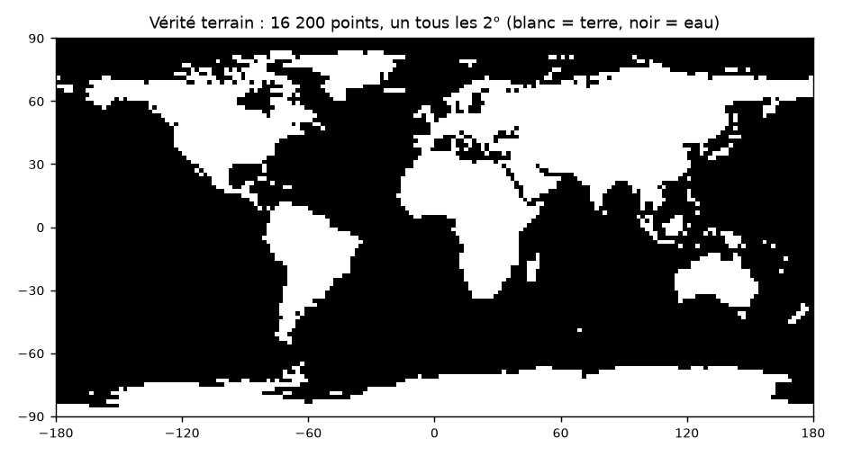

# Land on Earth

Reproduction de l'éval « Land or Water? » relayée par Karpathy, sur 24 modèles open-weight : 19 de la liste de départ, plus l'échelle de taille de Mistral. Mistral Large 3 est laissé de côté : Mistral ne le sert qu'à 0,5 requête par seconde sur un compte récent, soit 9 h à lui seul, et aucun autre fournisseur ne le sert à une précision connue. On demande au modèle « terre ou eau ? » pour 16 200 coordonnées, une tous les 2°, sans image ni outil, puis on redessine sa carte du monde et on la note contre un masque terre à 1 km, pondéré par la surface.



Coût prévu : environ 17 $ (≈ 15,5 €) pour 389 000 requêtes : environ 5 $ sur tes crédits OpenRouter, le reste facturé directement par SiliconFlow (≈ 5,4 $), Alibaba (≈ 5,2 $) et Mistral (≈ 1,6 $) via tes clés, plus quelques dizaines de centimes pour le pilote et la répétition générale. Durée du run : environ 1 h 15. SiliconFlow est prépayé : garde au moins 7 $ sur ton solde.

## Ce que tu fais, dans l'ordre

Tout se lance depuis le Terminal de ton Mac, dans le dossier du repo. Mets le projet hors d'iCloud (par exemple `~/Projets`, pas dans `Documents` ni sur le Bureau si ceux-ci sont synchronisés) : iCloud abîme l'environnement Python et ralentit le run.

**1. Installer uv** (gère Python et les dépendances), une seule fois :

```sh
brew install uv          # ou : curl -LsSf https://astral.sh/uv/install.sh | sh
git clone https://github.com/solalz1/land-on-earth-benchmark.git
cd land-on-earth-benchmark
make setup
```

**2. Ajouter la clé OpenRouter à ton terminal**, une seule fois. Ouvre `~/.zshrc` dans un éditeur (`open -e ~/.zshrc`), ajoute la ligne ci-dessous avec ta clé, enregistre, puis ouvre un nouveau terminal.

```sh
export OPENROUTER_API_KEY=sk-or-...
```

> Ne colle jamais la clé dans le chat, dans un fichier du repo ou dans une commande `git`. Le code la lit dans l'environnement, ne l'affiche jamais et ne l'écrit nulle part. Plafonne-la à 20 $ sur openrouter.ai/settings/keys.

**Tes clés fournisseurs.** OpenRouter limite les comptes récents à 20 requêtes par minute sur 8 de nos modèles, soit 14 h pour 16 200 points. Avec ta propre clé chez le fournisseur, cette limite ne s'applique pas : ce sont les limites de ton compte chez lui, et il te facture directement. Ajoute chaque clé dans OpenRouter (openrouter.ai/settings/integrations), section **Prioritized** (pas Fallback), avec **Use shared capacity**, et filtre-la sur ses modèles :

| Clé | Modèles (filtre) | Limite |
|---|---|---|
| SiliconFlow | `deepseek/deepseek-v4-pro`, `moonshotai/kimi-k2.6`, `z-ai/glm-5.2`, `z-ai/glm-5.3` | 500 requêtes/min par modèle |
| Alibaba Cloud (Model Studio, région Singapour) | `moonshotai/kimi-k3`, `qwen/qwen3.5-397b-a17b`, `qwen/qwen3.5-122b-a10b`, `qwen/qwen3.6-27b` | 600 requêtes/min par Qwen |
| Mistral | aucun filtre : les 5 modèles Mistral | par modèle, voir admin.mistral.ai > Limits |

Les 11 autres modèles passent par tes crédits OpenRouter, chez des fournisseurs sans limite pour les comptes récents (Novita, Parasail, DekaLLM) : ils n'ont pas besoin de tes clés. La répétition générale vérifie que chaque clé sert bien ses modèles, et seulement eux. Rien à changer dans le code.

**3. Vérifier, gratuitement** :

```sh
make demo     # facultatif : tout le pipeline contre une fausse API, dans results/demo/
make check    # clé et plafond, fournisseur de chaque modèle, précision, logprobs, prix réels
```

**4. Pilote (quelques dizaines de centimes, un quart d'heure)** : choisit la bonne façon d'interroger chaque modèle sur 8 points, pose 200 points à chacun et projette le coût du run. Relancé, il ne repose que les points manquants, ou tous ceux d'un modèle qui a changé de fournisseur. Il finit par une **répétition générale** : 300 nouveaux points par modèle, tous en même temps, avec exactement les réglages du run (fournisseur, tes clés, requêtes simultanées, rythme). Elle vérifie qu'aucun fournisseur ne refuse de requête, qu'aucune réponse n'est vide, que chacune de tes clés sert bien ses modèles, qu'aucun modèle ne bute sur la limite d'OpenRouter, et que la projection tient dans le budget et, pour la part payée en crédits OpenRouter, dans les crédits. Verdict dans `results/pilot/preflight.md` : feu vert ou feu rouge, avec la durée, le coût et qui paie quoi.

```sh
make pilot
git add results && git commit -m "Pilote" && git push
```

Le rapport est dans `results/pilot/report.md`. Claude le relit et corrige la config si un modèle échoue.

**5. Run complet (≈ 17 $, environ 1 h 15)**, Mac éveillé. Il ne part que si la répétition générale est au vert et que `configs/models.yaml` n'a pas changé depuis. Presque tous les modèles finissent en une demi-heure ; Ministral 3 14B ferme la marche, limité par Mistral à 4 requêtes par seconde.

```sh
caffeinate -i make run
```

S'il s'arrête (coupure réseau, Mac en veille, Ctrl-C) ou affiche « Run incomplet », relance la même commande : il reprend là où il s'est arrêté, sans reposer les questions déjà répondues, et redemande les points en erreur et les réponses vides (un fournisseur saturé ou qui renvoie une réponse vide). Dans un autre terminal, `make status` affiche l'avancement et le coût.

**6. Pousser les résultats** :

```sh
git add results && git commit -m "Run complet" && git push
```

## Commandes

| Commande | Coût | Ce qu'elle fait |
|---|---|---|
| `make check` | gratuit | lit la clé (plafond, reste) et la fiche OpenRouter de chaque modèle |
| `make demo` | gratuit | check, pilote, run, classement et cartes contre une fausse API |
| `make pilot` | quelques dizaines de centimes | stratégie de chaque modèle, 200 points, rapport, puis répétition générale (300 points par modèle aux réglages du run) : feu vert ou rouge, coût, durée et qui paie |
| `make probe-gpt-oss` | < 1 centime | cherche un fournisseur qui fait tourner gpt-oss sans réflexion |
| `make run` | ≈ 17 $ | 16 200 points × modèles validés au pilote, puis classement, cartes, compression |
| `make status` | gratuit | avancement et coût du run |
| `make score` | gratuit | recalcule classement et cartes depuis les réponses enregistrées |
| `make test` | gratuit | tests automatiques, contre la fausse API |

Options utiles : `uv run python -m loe run --models qwen3.5-9b,gemma-4-31b` pour quelques modèles, `--budget 10` pour plafonner le coût du run, crédits et clés fournisseurs compris (22 $ par défaut). `uv run python -m loe preflight` relance la répétition générale seule. `uv run python -m loe probe --model gpt-oss-20b --provider deepinfra,parasail --strategy raw` essaie un modèle chez d'autres fournisseurs que celui de la config, 8 points par essai.

Le `Makefile` lance le code avec `python -m loe` : Python exécute directement le dossier `loe/` du projet, sans dépendre du lien que uv installe dans `.venv`.

## Comment ça marche

**La question**, identique pour tous les modèles, à température 0 :

```text
Coordinates: 41.0, -73.0
Land or Water? Answer with one word: Land or Water.
```

**Le fournisseur est épinglé** à chaque requête : un seul fournisseur autorisé, pas de repli silencieux vers un autre (souvent en FP4), et refus de tout fournisseur qui ignorerait un paramètre. Le fournisseur qui a réellement répondu est enregistré avec chaque réponse.

```json
"provider": {"only": ["parasail"], "allow_fallbacks": false, "require_parameters": true, "quantizations": ["fp8"]}
```

**Sept façons de poser la question**, essayées dans l'ordre par le pilote, qui garde la première qui marche : sans réflexion d'abord, avec logprobs puis sans, et la réflexion minimale seulement en dernier recours.

| Stratégie | Quand |
|---|---|
| `chat_none` | chat, réflexion coupée (`reasoning: {effort: none}`) : le cas normal |
| `chat` | modèles sans paramètre de réflexion (Llama) |
| `raw` | prompt brut : template officiel du modèle (Hugging Face) + réponse pré-remplie, si le fournisseur le transmet tel quel |
| `text_none`, `text` | comme `chat_none` et `chat`, sans logprobs : fournisseur qui n'en renvoie pas (Mistral, SiliconFlow) ou qui refuse le paramètre |
| `chat_low`, `text_low` | dernier recours, pour les modèles qui ne peuvent pas répondre sans réfléchir (gpt-oss, GLM-5.3, MiniMax M3) : réflexion minimale, avec ou sans logprobs |

La température est à 0 partout, sauf pour Kimi K3 chez Alibaba, qui ne la laisse pas régler (comme Moonshot, son créateur) : la requête l'omet, sinon le fournisseur serait refusé. Sa réponse est lue dans les logprobs, donc reste la plus probable des deux.

Une stratégie passe si au moins 7 réponses sur 8 arrivent, sont lisibles, ne montrent pas de réflexion (sauf `chat_low` et `text_low`), et viennent du fournisseur épinglé. Les logprobs sont utilisés quand le fournisseur les renvoie, mais pas exigés : la carte du tweet n'a besoin que de la réponse. Quand ils sont là, Land et Water doivent porter l'essentiel de la probabilité.

**Le rapport du pilote** donne une précision estimée : les 200 points (moitié terre, moitié eau, beaucoup près des pôles) sont repondérés par la fréquence de leur classe et la surface de leur cellule, pour estimer la précision pondérée de la carte complète, avec un intervalle à 90 %.

**La réponse** : au premier token qui n'est pas de la mise en forme, P(Land) = masse de « Land » / (masse de « Land » + masse de « Water »), en additionnant les variantes (` Land`, `land`, `LAND`…) parmi les 20 meilleurs. La prédiction est la plus probable des deux. Sans logprobs, on lit le premier « Land » ou « Water » du texte.

**Les garde-fous du run** : répétition générale au vert avant le départ ; budget global (22 $ par défaut, compté sur les réponses déjà enregistrées, y compris ce que tes clés fournisseurs te facturent, qu'OpenRouter ne compte pas) ; arrêt d'un modèle dont le coût projeté dépasse 2,5 fois son estimation, ou 1,5 fois la projection du pilote (un modèle qui se met à raisonner plus que prévu) ; arrêt d'un modèle après 25 erreurs d'affilée, hors limites de débit (429) et budget en vol d'OpenRouter (402), qui ne font que ralentir ; un refus du fournisseur (ta clé chez lui refusée, par exemple) n'arrête que ce modèle ; arrêt immédiat si la clé OpenRouter est refusée ou les crédits épuisés ; reprise avec backoff exponentiel sur les erreurs 429 et 5xx.

**Le rythme** : chaque modèle a ses requêtes simultanées (`concurrency`, de 8 à 40) et, quand son fournisseur a une limite, un rythme juste en dessous (`rpm`) : 480 par minute chez SiliconFlow (limite 500), 550 chez Alibaba (600), et les limites de ton compte Mistral (230 par minute pour Ministral 14B). Le code espace alors les requêtes au lieu de les voir refusées puis réessayées. Au démarrage, il relève aussi la limite de fichiers ouverts du Mac (256 par défaut), car près de 400 requêtes tournent en même temps.

**Les scores** (`results/tweet/leaderboard.md`) :

- **Précision** : part de la surface du globe correctement classée (poids = cosinus de la latitude) ; un point sans réponse compte faux.
- **Skill** : gain sur la réponse constante « toujours Water », qui fait déjà 71,0 % : (précision − 0,71) / (1 − 0,71).
- **Avec lacs** : même précision, en comptant comme eau les grands lacs et la Caspienne, que le masque 1 km classe en terre.
- Rappel et précision sur la terre, couverture, score de Brier quand il y a des logprobs.
- **Réflexion** : « aucune » pour les modèles qui répondent directement, « minimale » pour ceux qui ne peuvent pas répondre sans réfléchir. Leur carte porte la mention « (réflexion) » sur la figure.

**Les cartes** (`results/tweet/maps/`) : une par modèle (blanc = terre, noir = eau, gris = sans réponse), la carte de probabilité (`prob/`), la carte des erreurs (`errors/` : rouge = terre répondue sur de l'eau, bleu = eau répondue sur de la terre), et `montage.png`, la figure au format du tweet.

## Vérité terrain

`data/grid.csv` contient les 16 200 points (centres des cellules de 2°, latitudes −89 à 89, longitudes −179 à 179) avec :

- `truth` : masque terre GLOBE à 1 km (paquet `global-land-mask`), au plus près du « 1-km land mask » du tweet ; 29,0 % de terre en surface.
- `truth_lakes` : le même, avec les lacs Natural Earth 1:10m et la mer Caspienne comptés comme eau (48 points changent).
- `weight` : cosinus de la latitude, proportionnel à la surface de la cellule.

Le fichier est commité ; `make truth` le reconstruit.

## Fichiers

```text
configs/models.yaml     les 24 modèles : identifiant OpenRouter, fournisseur, précision, prix, stratégies, rythme, clé
data/grid.csv           la grille et la vérité terrain
loe/                    le code : client OpenRouter, pilote, run, scoring, cartes, fausse API
scripts/build_truth.py  construction de data/grid.csv
tests/                  tests contre la fausse API
results/check.json      sortie de make check
results/pilot/          rapport du pilote, stratégies retenues, répétition générale (preflight.md), réponses brutes compressées
results/probe/          essais chez d'autres fournisseurs (make probe-gpt-oss)
results/tweet/          run complet : réponses (raw/*.jsonl.gz), prédictions, classement, cartes
```
