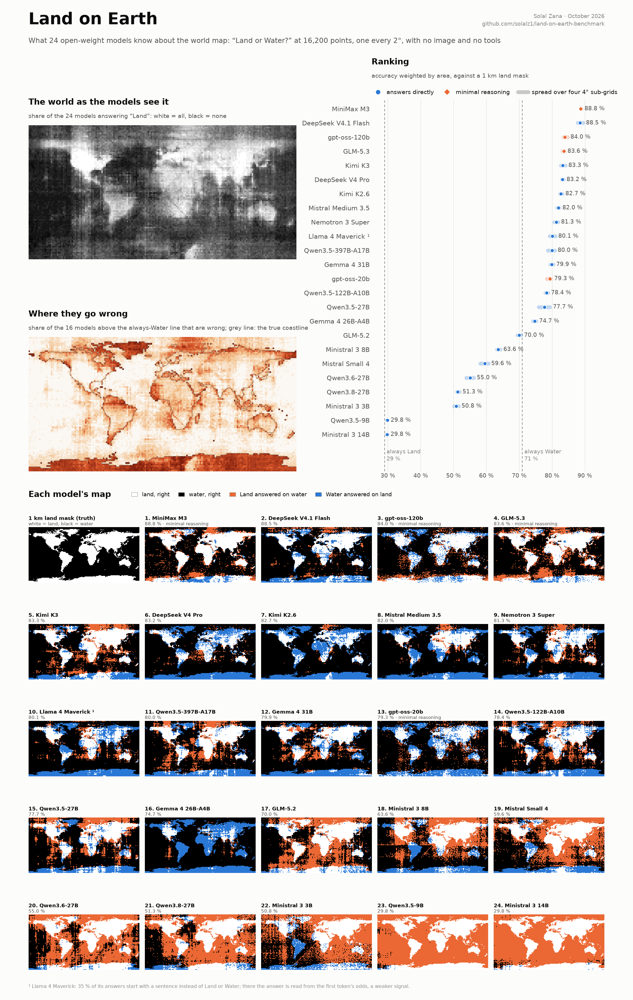
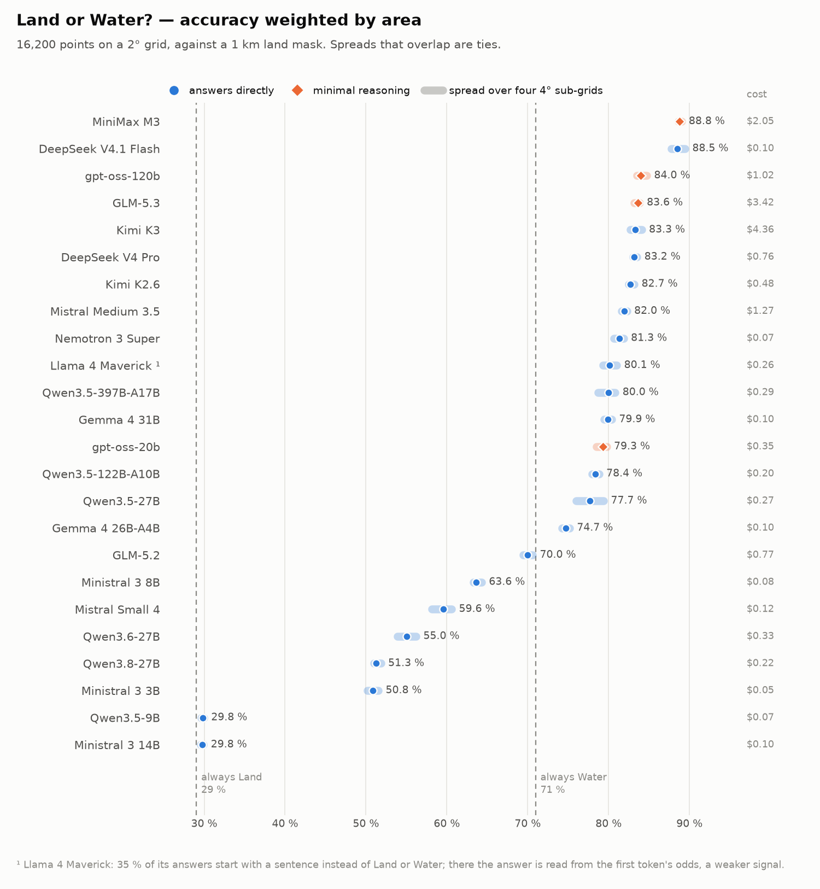
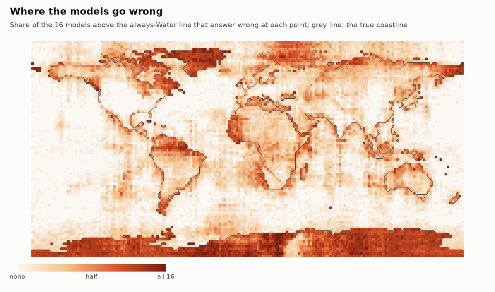
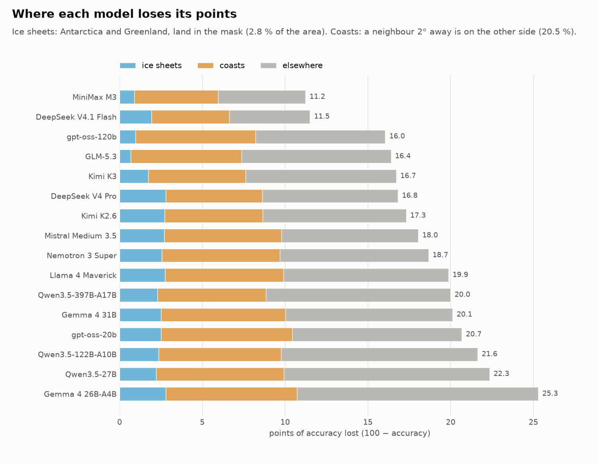
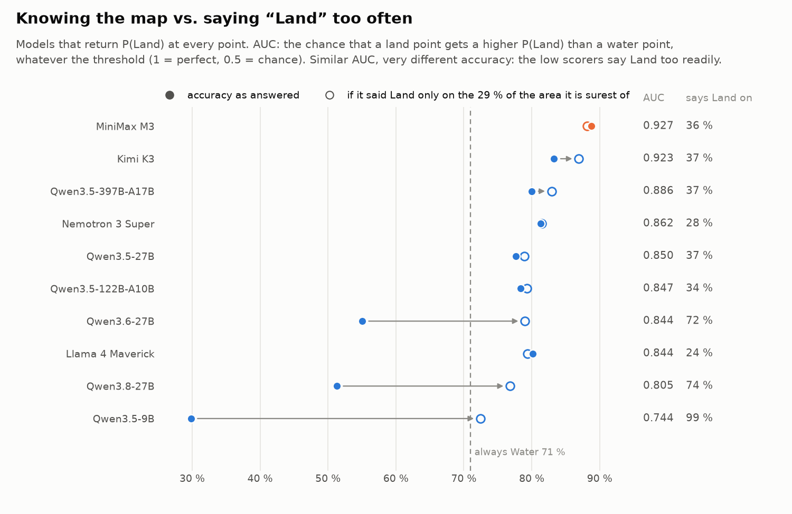

# Land on Earth — results

24 open-weight models were asked “Land or Water?” at 16,200 coordinates, with no image and no tools, and scored against a 1 km land mask. This reproduces the “Land or Water?” map eval shared by Andrej Karpathy. Run of 6 October 2026: 389,196 requests, $16.85 in total.



**In short**

- MiniMax M3 (88.8 %) and DeepSeek V4.1 Flash (88.5 %) are tied at the top. Flash cost $0.10 for the whole map, MiniMax $2.05.
- Five models sit between 82.7 % and 84.0 %, too close to rank: gpt-oss-120b, GLM-5.3, Kimi K3, DeepSeek V4 Pro and Kimi K2.6.
- 8 of the 24 models do no better than always answering “Water” (71.0 %). The ones we can measure fail mostly by saying “Land” far too often, not by knowing nothing: Qwen3.6-27B separates land from water about as well as Qwen3.5-27B, yet scores 55.0 % against 77.7 %.
- Coasts and ice sheets make most of the difference between good models. The mask counts Antarctica as land; every model above the always-Water line that answers without reasoning calls most of it “Water”.

## Setup

- **The question**, the same for every model:

  ```text
  Coordinates: 41.0, -73.0
  Land or Water? Answer with one word: Land or Water.
  ```

  Temperature 0, except for Kimi K3, whose provider refuses the parameter; its answer is read from the logprobs, so it is still the more probable of the two words.
- **The grid**: 16,200 points, the centres of 2° cells (latitudes −89 to 89, longitudes −179 to 179).
- **The truth**: the GLOBE 1 km land mask (`global-land-mask`), 29.0 % land by area. It counts the Antarctic and Greenland ice sheets as land, and large lakes and the Caspian Sea as land too. Counting those lakes as water changes no score by more than a third of a point.
- **The score**: the share of the globe's area answered correctly, each point weighted by the cosine of its latitude. Always answering “Water” scores 71.0 %, always “Land” 29.0 %.
- **Providers**: each model is pinned to one provider at a fixed precision through OpenRouter, with no fallback, and any provider that would ignore a parameter is refused ([`configs/models.yaml`](configs/models.yaml)).
- **Reasoning**: switched off whenever the model allows it. Four models cannot answer without it (MiniMax M3, gpt-oss-120b, GLM-5.3, gpt-oss-20b); they get the minimal setting.
- **Reading the answer**: with logprobs, P(Land) = mass(Land) / (mass(Land) + mass(Water)) at the first token that is not markup, and the prediction is the more probable word. Without them, the first “Land” or “Water” in the text.

All 24 models answered all 16,200 points.

## Leaderboard



| # | Model | Lab | Reasoning | Accuracy | Sub-grids | Says Land on | Answer read from | Provider | Cost |
|---:|---|---|---|---:|---:|---:|---|---|---:|
| 1 | MiniMax M3 | MiniMax | minimal | 88.8 % | 88.6–89.0 | 36 % | logprobs | Parasail | $2.05 |
| 2 | DeepSeek V4.1 Flash | DeepSeek | none | 88.5 % | 87.8–89.5 | 25 % | logprobs 78 %, else text | Novita | $0.10 |
| 3 | gpt-oss-120b | OpenAI | minimal | 84.0 % | 83.5–84.7 | 29 % | logprobs 26 %, else text | Novita | $1.02 |
| 4 | GLM-5.3 | Z.ai | minimal | 83.6 % | 83.2–83.8 | 41 % | text | SiliconFlow | $3.42 |
| 5 | Kimi K3 | Moonshot | none | 83.3 % | 82.7–84.1 | 37 % | logprobs | Alibaba | $4.36 |
| 6 | DeepSeek V4 Pro | DeepSeek | none | 83.2 % | 83.0–83.5 | 21 % | text | SiliconFlow | $0.76 |
| 7 | Kimi K2.6 | Moonshot | none | 82.7 % | 82.5–83.2 | 14 % | text | SiliconFlow | $0.48 |
| 8 | Mistral Medium 3.5 | Mistral | none | 82.0 % | 81.6–82.3 | 19 % | text | Mistral | $1.27 |
| 9 | Nemotron 3 Super | NVIDIA | none | 81.3 % | 80.6–81.9 | 28 % | logprobs | DekaLLM | $0.07 |
| 10 | Llama 4 Maverick ¹ | Meta | none | 80.1 % | 79.3–81.0 | 24 % | logprobs | Parasail | $0.26 |
| 11 | Qwen3.5-397B-A17B | Alibaba | none | 80.0 % | 78.7–80.8 | 37 % | logprobs | Alibaba | $0.29 |
| 12 | Gemma 4 31B | Google | none | 79.9 % | 79.5–80.4 | 30 % | logprobs 32 %, else text | Novita | $0.10 |
| 13 | gpt-oss-20b | OpenAI | minimal | 79.3 % | 78.5–79.8 | 21 % | logprobs 81 %, else text | Novita | $0.35 |
| 14 | Qwen3.5-122B-A10B | Alibaba | none | 78.4 % | 77.9–78.8 | 34 % | logprobs | Alibaba | $0.20 |
| 15 | Qwen3.5-27B | Alibaba | none | 77.7 % | 76.0–79.4 | 37 % | logprobs | Novita | $0.27 |
| 16 | Gemma 4 26B-A4B | Google | none | 74.7 % | 74.2–75.2 | 8 % | logprobs 19 %, else text | Novita | $0.10 |
| 17 | GLM-5.2 | Z.ai | none | 70.0 % | 69.4–70.6 | 54 % | text | SiliconFlow | $0.77 |
| 18 | Ministral 3 8B | Mistral | none | 63.6 % | 63.3–64.3 | 49 % | text | Mistral | $0.08 |
| 19 | Mistral Small 4 | Mistral | none | 59.6 % | 58.1–60.6 | 59 % | text | Mistral | $0.12 |
| 20 | Qwen3.6-27B | Alibaba | none | 55.0 % | 53.9–56.2 | 72 % | logprobs | Alibaba | $0.33 |
| 21 | Qwen3.8-27B | Alibaba | none | 51.3 % | 51.0–51.8 | 74 % | logprobs | Parasail | $0.22 |
| 22 | Ministral 3 3B | Mistral | none | 50.8 % | 50.2–51.5 | 65 % | text | Mistral | $0.05 |
| 23 | Qwen3.5-9B | Alibaba | none | 29.8 % | 29.6–30.0 | 99 % | logprobs | Parasail | $0.07 |
| 24 | Ministral 3 14B | Mistral | none | 29.8 % | 29.5–29.9 | 99 % | text | Mistral | $0.10 |

**Sub-grids**: the lowest and highest accuracy over the four 4° grids made of every other row and column (section 1). **Says Land on**: the share of the globe's area the model calls land; the truth is 29 %. The full metrics are in [`results/tweet/leaderboard.md`](results/tweet/leaderboard.md) (in French) and [`leaderboard.csv`](results/tweet/leaderboard.csv).

¹ 35 % of its answers start with a sentence instead of Land or Water; see [section 6](#6-two-quirks-of-the-answer-format).

## How to read the results

### 1. Under about one point, it's a tie

The 2° grid is one choice among many. Split it into four 4° grids (every other row and column) and score each one, and every model gets a spread: how much its score depends on where the points fall. When two spreads overlap, the order between the two models changes from one sub-grid to the next. MiniMax M3, for instance, beats DeepSeek V4.1 Flash on two of the four sub-grids and loses on the other two. The leaderboard reads best as groups:

- **88.5–88.8 %**: MiniMax M3, DeepSeek V4.1 Flash.
- **82.7–84.0 %**: gpt-oss-120b, GLM-5.3, Kimi K3, DeepSeek V4 Pro, Kimi K2.6, with Mistral Medium 3.5 (82.0 %) just below.
- **77.7–81.3 %**: Nemotron 3 Super, Llama 4 Maverick, Qwen3.5-397B, Gemma 4 31B, gpt-oss-20b, Qwen3.5-122B, Qwen3.5-27B.
- Then Gemma 4 26B-A4B (74.7 %), and eight models at or below the always-Water line.

### 2. Coasts hold about half the errors of the best models

At this resolution, 20.5 % of the globe's area is coastal: a neighbouring point 2° away is on the other side. Those points hold about 47 % of the errors of MiniMax M3, DeepSeek V4.1 Flash and gpt-oss-120b, and 35–44 % for the other models above the always-Water line. MiniMax M3 scores 92.6 % away from the coasts and 73.9 % on them.



The map of where the 16 models above the always-Water line go wrong shows the rest. Most of them are wrong on 8.9 % of the globe's area; half of that is coastal, and 30 % is on the ice sheets (section 3). A few regions stand out (each figure is the average share of the 16 models that answer wrong):

- **The Canadian Arctic Archipelago**, a maze of islands and channels: 50 % wrong.
- **Land near the equator**: within 5° of it, 50 % of the answers on land are “Water”, against 28 % between 11° and 25° of latitude. The Amazon basin is the worst case (63 % wrong); equatorial Africa is milder (35 %).
- **The western edge of West Africa** (land west of 10°W, between 10°N and 30°N): 67 % answered “Water”.

### 3. The ice sheets split the field

The mask counts Antarctica and Greenland as land: 2.8 % of the globe's area. Whether ice is land is a convention, and the models disagree on it:

- MiniMax M3, GLM-5.3 and gpt-oss-120b, three of the four models that reason, call 69–77 % of Antarctica land.
- DeepSeek V4 Pro (1 %), Gemma 4 26B-A4B (2 %), Llama 4 Maverick (3 %), Kimi K2.6 (4 %) and Mistral Medium 3.5 (5 %) almost never do.

That costs the second group 2.7–2.8 points each, against about 1 point or less for the first: enough to reorder the middle of the leaderboard.



Open sea and inland points (“elsewhere”) still cost the most: about 5 to 15 points for the 16 models above the always-Water line.

### 4. A very low score is mostly a bias toward “Land”, not ignorance

Ten models return P(Land) at every point. For them, the AUC measures how well P(Land) separates land from water whatever the threshold. It is the chance that a land point gets a higher P(Land) than a water point (1 = perfect, 0.5 = chance), with every point weighted by its area.

- Qwen3.6-27B has an AUC of 0.844, about the same as Qwen3.5-27B (0.850), yet scores 55.0 % against 77.7 %: it calls 72 % of the globe land.
- Had it answered “Land” only on the 29 % of the area where its P(Land) is highest, it would score 79.0 %. Qwen3.8-27B would go from 51.3 % to 76.8 %.
- Qwen3.5-9B is weak on both counts: AUC 0.744, and even with the right share of land it would reach only 72.4 %, barely above always Water.

That “right share” uses the true 29 %, which a model cannot know: it is a diagnostic, not a fairer score.



The Mistral models answer in text only, so they cannot be measured this way. Ministral 3 14B wrote “Land” on 15,896 of the 16,200 points, and scores below both Ministral 3 8B (63.6 %) and 3B (50.8 %). A bias seems more likely than a smaller model knowing more, but without logprobs that is a guess. The question names “Land” first, which may play a part; the reversed order was not tested.

### 5. Reasoning is not compared like for like

Four models reason before answering, at the minimal setting, because they cannot answer otherwise; the other twenty answer straight away. Two of the top three reason, and three of the four that reason are the only models above the always-Water line that call most of Antarctica land. So GLM-5.2 (70.0 %, no reasoning) against GLM-5.3 (83.6 %, minimal reasoning) measures the new version and the reasoning together, not the version alone.

### 6. Two quirks of the answer format

**Llama 4 Maverick.** 35 % of its answers start with a sentence (“To determine whether…”) instead of Land or Water, and the 8-token limit cuts them. On those points, the prediction is read from the odds of “Land” against “Water” as the first word, where the two words hold only 16 % of the probability in the median case, against 97 % when the model answers directly. Those points are also harder: it gets 66.7 % of them right, against 86.6 % elsewhere. Its 80.1 % mixes a strong signal with a weak one.

**The diagonals.** Several maps show straight diagonal lines, for example those of Ministral 3 3B and 8B, Gemma 4 31B, Llama 4 Maverick and Qwen3.5-27B. These are the points where the latitude equals the longitude or its opposite, so the question repeats the same number. The true share of land on them is the same as on the neighbouring diagonals (42 % against 43 % for lat = lon), but the answers are not. Ministral 3 3B says “Land” on 95 % of the lat = lon points, against 60 % of their neighbours. Gemma 4 31B says “Land” on 3 % of the lat = −lon points, against 39 %. The model reacts to the text, not to the place. These 180 points are about 1 % of the grid, so the scores barely move.

### 7. A 200-point pilot can choose a strategy, not rank models

Before the run, a pilot asked each model 200 points, half land and half water, to choose how to query it, and estimated its accuracy from them. Some estimates were far off: Kimi K3 went from 89.8 % to 83.3 % on the full map, Qwen3.5-397B from 85.7 % to 80.0 %. The models did not change in between. Scored on the same 200 points, the full run gives back 89.9 % and 85.3 %: those points were simply easier for them than the globe. With a 90 % margin of 3 to 7 points depending on the model, a pilot this size picks the strategy; it cannot rank the models.

## Cost

| Paid by | Cost |
|---|---:|
| SiliconFlow, own key | $5.42 |
| Alibaba Cloud, own key | $5.15 |
| OpenRouter credits | $4.66 |
| Mistral, own key | $1.63 |
| **Total** | **$16.85** |

The best value is near the top: DeepSeek V4.1 Flash scored 88.5 % for $0.10. The most expensive model, Kimi K3 at $4.36, is in the second group.

## Reproduce

```sh
make score    # leaderboard and maps from the stored answers (results/tweet/raw/)
make figure   # these figures, and every number on this page in results/tweet/figures/stats.json
```

To run everything again from scratch, see the [README](README.md) (in French).

## Files

| Path | Contents |
|---|---|
| [`results/tweet/figures/`](results/tweet/figures/) | the figures on this page and `stats.json` |
| [`results/tweet/leaderboard.md`](results/tweet/leaderboard.md), `.csv`, `.json` | the leaderboard with every metric |
| [`results/tweet/maps/`](results/tweet/maps/) | each model's map: answers, P(Land), errors, and `montage.png` |
| [`results/tweet/predictions/`](results/tweet/predictions/) | each model's answer at each point |
| [`results/tweet/raw/`](results/tweet/raw/) | every request and answer, compressed JSON lines |
